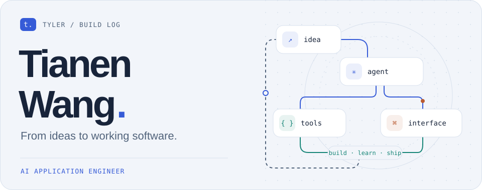
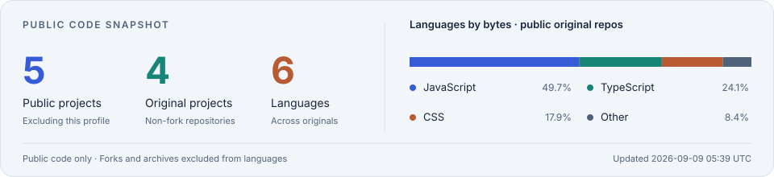

<picture>
  <source media="(prefers-color-scheme: dark)" srcset="./assets/hero-dark.svg" />
  
</picture>

  <a href="https://blog.351419564.xyz"><strong>Read my blog ↗</strong></a>
  &nbsp; · &nbsp;
  <a href="#selected-work">Explore my work ↓</a>
  &nbsp; · &nbsp;
  <a href="https://github.com/Tyleronthebase?tab=repositories">All repositories ↗</a>

### Hi, I'm Tianen. You can call me Tyler.

AI Application Engineer at **Panasonic Digital (Shanghai)** · M.Sc. Software Engineering, **Cardiff University**.

I build AI interfaces, developer tools, and small web experiments. My current interests are **agentic workflows with LangGraph and MCP**, **local SRE agents**, and **Cloudflare-native applications**.

把想法写成代码，把代码做成能用的东西。这里记录我的 AI 应用、开发工具与 Web 实验。

## Selected work

### [Mini Chat AI ↗](https://github.com/Tyleronthebase/chat-mini-ai)

A lightweight chat interface with **streaming replies**, local conversation history, and Markdown rendering. Includes OpenAI-compatible and Gemini connection modes.

`React` `Vite` `Node.js` `SSE` `OpenAI-compatible API`

### [Video Downloader ↗](https://github.com/Tyleronthebase/video-downloader)

A full-stack experiment in **video metadata, format selection, and downloads**. A Next.js interface talks to a Python API built around yt-dlp, with a Docker Compose setup.

`Next.js` `TypeScript` `FastAPI` `yt-dlp` `Docker`

### [PDF Editor ↗](https://github.com/Tyleronthebase/pdf-editor) · prototype

A browser-based **PDF annotation playground** exploring text, image, and shape overlays, with export experiments using PDF.js, Fabric.js, and pdf-lib.

`React` `TypeScript` `PDF.js` `Fabric.js` `pdf-lib`

### [Insomnia Meter ↗](https://github.com/Tyleronthebase/insomnia-meter) · creative coding

A small **neo-noir web experience** built with video, typography, and a single interaction. Plain HTML, CSS, and JavaScript, deployed to Cloudflare Pages.

`HTML` `CSS` `JavaScript` `Cloudflare Pages` · [Open the experience ↗](https://music.351419564.xyz)

  
<strong>Also exploring: a Cloudflare-native blog</strong>

[Flare Stack Blog](https://github.com/Tyleronthebase/flare-stack-blog) is my fork of [du2333/flare-stack-blog](https://github.com/du2333/flare-stack-blog), which I use to explore a Cloudflare-native CMS stack: TanStack Start, Hono, D1, R2, KV, and Drizzle ORM.

## Tools I build with

**Application development** &nbsp; `TypeScript` `JavaScript` `Python` `React` `Next.js` `FastAPI`

**AI interfaces** &nbsp; `OpenAI-compatible APIs` `Gemini` `SSE` · Exploring `LangGraph` and `MCP`

**Edge & delivery** &nbsp; `Cloudflare Workers / Pages` `Docker` `GitHub Actions` `Vite`

## Open-source footprint

<picture>
  <source media="(prefers-color-scheme: dark) and (max-width: 600px)" srcset="./assets/stats-mobile-dark.svg" />
  <source media="(max-width: 600px)" srcset="./assets/stats-mobile-light.svg" />
  <source media="(prefers-color-scheme: dark)" srcset="./assets/stats-dark.svg" />
  
</picture>

Public projects only; this profile is excluded. Language share reflects code volume, not proficiency. [How these charts update](./docs/MAINTENANCE.md).

  
<strong>Watch my contribution graph turn into a snake 🐍</strong>

   
  <picture>
    <source media="(prefers-color-scheme: dark)" srcset="./assets/contributions-dark.svg" />
    
  </picture>
  
A little motion from <a href="https://github.com/Platane/snk">Platane/snk</a>. Refreshed daily with GitHub Actions.

---

  <strong>Small experiments. Useful software. Always learning.</strong> 
  <a href="https://blog.351419564.xyz">Notes from the build ↗</a> &nbsp; / &nbsp; <a href="https://github.com/Tyleronthebase">@Tyleronthebase</a>

